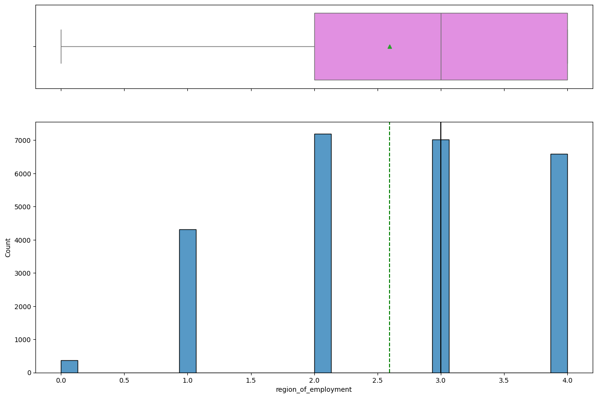
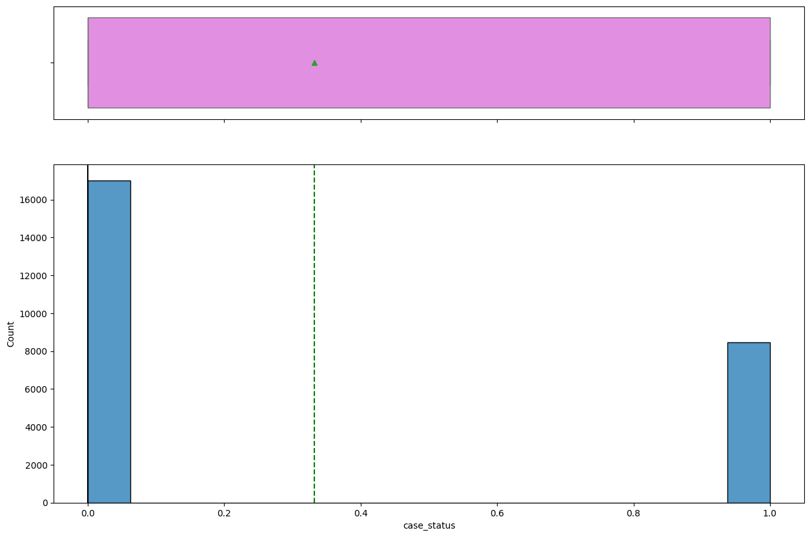
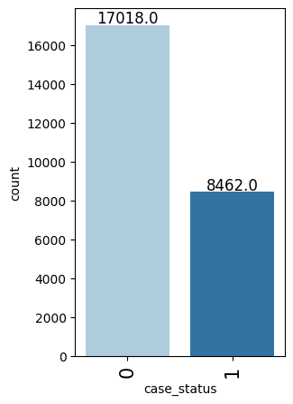
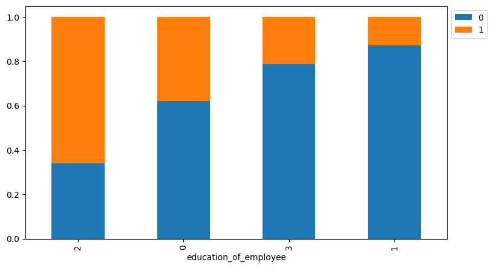

# Student Submission Report

This report reconstructs the Jupyter Notebook submission from parsed HTML.

Problem Statement
¶

---

Business Context
¶

---

Business communities in the United States are facing high demand for human resources, but one of the constant challenges is identifying and attracting the right talent, which is perhaps the most important element in remaining competitive. Companies in the United States look for hard-working, talented, and qualified individuals both locally as well as abroad.
The Immigration and Nationality Act (INA) of the US permits foreign workers to come to the United States to work on either a temporary or permanent basis. The act also protects US workers against adverse impacts on their wages or working conditions by ensuring US employers' compliance with statutory requirements when they hire foreign workers to fill workforce shortages. The immigration programs are administered by the Office of Foreign Labor Certification (OFLC).
OFLC processes job certification applications for employers seeking to bring foreign workers into the United States and grants certifications in those cases where employers can demonstrate that there are not sufficient US workers available to perform the work at wages that meet or exceed the wage paid for the occupation in the area of intended employment.

---

Objective
¶

---

In FY 2016, the OFLC processed 775,979 employer applications for 1,699,957 positions for temporary and permanent labor certifications. This was a nine percent increase in the overall number of processed applications from the previous year.
The process of reviewing every case is becoming a tedious task as the number of applicants is increasing every year.
The increasing number of applicants every year calls for a Machine Learning based solution that can help in shortlisting the candidates having higher chances of VISA approval. OFLC has hired the firm EasyVisa for data-driven solutions. You as a data  scientist at EasyVisa have to analyze the data provided and, with the help of a
classification model
:
Facilitate the process of visa approvals.
Recommend a suitable profile for the applicants for whom the visa should be certified or denied based on the drivers that significantly influence the case status.

---

Data Description
¶

---

The detailed data dictionary is given below:
case_id
: ID of each visa application
continent
: Continent where the employee resides
education_of_employee
: Information of education of the employee
has_job_experience
: Does the employee have any job experience? Y= Yes; N = No
requires_job_training
: Does the employee require any job training? Y = Yes; N = No
no_of_employees
: Number of employees in the employer's company
yr_of_estab
: Year in which the employer's company was established
region_of_employment
: Information of foreign worker's intended region of employment in the US.
prevailing_wage
: Average wage paid to similarly employed workers in a specific occupation in the area of intended employment. The purpose of the prevailing wage is to ensure that the foreign worker is not underpaid compared to other workers offering the same or similar service in the same area of employment.
unit_of_wage
: Unit of prevailing wage. Values include Hourly, Weekly, Monthly, and Yearly.
full_time_position
: Is the position of work full-time? Y = Full Time Position; N = Part Time Position
case_status
:  Flag indicating if the Visa was certified or denied

---

Installing and Importing Necessary Libraries
¶

---

### Code Block 1
```python
# Installing the libraries with the specified version.
!pip install numpy==1.25.2 pandas==1.5.3 scikit-learn==1.5.2 matplotlib==3.7.1 seaborn==0.13.1 xgboost==2.0.3 -q --user
```

#### Output:
```
Drive already mounted at /content/drive; to attempt to forcibly remount, call drive.mount("/content/drive", force_remount=True).
```

---

### Code Block 2
```python
import warnings
warnings.filterwarnings("ignore")

# Libraries to help with reading and manipulating data
import numpy as np
import pandas as pd

# Library to split data
from sklearn.model_selection import train_test_split

# To oversample and undersample data
from imblearn.over_sampling import SMOTE
from imblearn.under_sampling import RandomUnderSampler
from sklearn.model_selection import train_test_split, StratifiedKFold, cross_val_score

# Libaries to help with data visualization
import matplotlib.pyplot as plt
import seaborn as sns

# Removes the limit for the number of displayed columns
pd.set_option("display.max_columns", None)
# Sets the limit for the number of displayed rows
pd.set_option("display.max_rows", 100)

# Libraries for different ensemble classifiers
from sklearn.ensemble import (
    BaggingClassifier,
    RandomForestClassifier,
    AdaBoostClassifier,
    GradientBoostingClassifier
)
from xgboost import XGBClassifier
from sklearn.tree import DecisionTreeClassifier

# Libraries to get different metric scores
from sklearn import metrics
from sklearn.metrics import (
    confusion_matrix,
    accuracy_score,
    precision_score,
    recall_score,
    f1_score,
)
# To tune different models
from sklearn.model_selection import RandomizedSearchCV
```

#### Output:
   Unnamed: 0 case_id continent education_of_employee has_job_experience requires_job_training  no_of_employees  yr_of_estab region_of_employment  prevailing_wage unit_of_wage full_time_position case_status
0           0  EZYV01      Asia           High School                  N                     N            14513         2007                 West         592.2029         Hour                  Y      Denied
1           1  EZYV02      Asia              Master's                  Y                     N             2412         2002            Northeast       83425.6500         Year                  Y   Certified
2           2  EZYV03      Asia            Bachelor's                  N                     Y            44444         2008                 West      122996.8600         Year                  Y      Denied
3           3  EZYV04      Asia            Bachelor's                  N                     N               98         1897                 West       83434.0300         Year                  Y      Denied
4           4  EZYV05    Africa              Master's                  Y                     N             1082         2005                South      149907.3900         Year                  Y   Certified

---

Import Dataset
¶

---

### Code Block 3
```python
# Mount Google Drive
from google.colab import drive
drive.mount('/content/drive')
```

#### Output:
   Unnamed: 0    case_id continent education_of_employee has_job_experience requires_job_training  no_of_employees  yr_of_estab region_of_employment  prevailing_wage unit_of_wage full_time_position case_status
0       25475  EZYV25476      Asia            Bachelor's                  Y                     Y             2601         2008                South         77092.57         Year                  Y   Certified
1       25476  EZYV25477      Asia           High School                  Y                     N             3274         2006            Northeast        279174.79         Year                  Y   Certified
2       25477  EZYV25478      Asia              Master's                  Y                     N             1121         1910                South        146298.85         Year                  N   Certified
3       25478  EZYV25479      Asia              Master's                  Y                     Y             1918         1887                 West         86154.77         Year                  Y   Certified
4       25479  EZYV25480      Asia            Bachelor's                  Y                     N             3195         1960              Midwest         70876.91         Year                  Y   Certified

---

### Code Block 4
```python
# Select Dataset
visa = pd.read_csv('/content/drive/MyDrive/AIML Course/Module 3 - Advanced Machine Learning/Project/EasyVisa.csv')
```

#### Output:
```
(25480, 12)
```

---

### Code Block 5
```python
# Copying data to another variable to avoid any changes to original data
data = visa.copy()
```

#### Output:
<class 'pandas.core.frame.DataFrame'>
RangeIndex: 25480 entries, 0 to 25479
Data columns (total 12 columns):
 #   Column                 Non-Null Count  Dtype  
---  ------                 --------------  -----  
 0   case_id                25480 non-null  object 
 1   continent              25480 non-null  object 
 2   education_of_employee  25480 non-null  object 
 3   has_job_experience     25480 non-null  object 
 4   requires_job_training  25480 non-null  object 
 5   no_of_employees        25480 non-null  int64  
 6   yr_of_estab            25480 non-null  int64  
 7   region_of_employment   25480 non-null  object 
 8   prevailing_wage        25480 non-null  float64
 9   unit_of_wage           25480 non-null  object 
 10  full_time_position     25480 non-null  object 
 11  case_status            25480 non-null  object 
dtypes: float64(1), int64(2), object(9)
memory usage: 2.3+ MB

---

Overview of the Dataset
¶

---

View the first and last 5 rows of the dataset
¶

---

### Code Block 6
```python
## View top 5 rows of the data
data.head()
```

#### Output:
```
0
```

---

### Code Block 7
```python
## View last 5 rows of the data
data.tail()
```

#### Output:
  Unnamed: 0  no_of_employees   yr_of_estab  prevailing_wage
0      count     25480.000000  25480.000000     25480.000000
1       mean      5667.043210   1979.409929     74455.814592
2        std     22877.928848     42.366929     52815.942327
3        min       -26.000000   1800.000000         2.136700
4        25%      1022.000000   1976.000000     34015.480000

---

Initial Feature Observations
¶
Based on a quick scan of the dataset, there are both categorical and numerical features, making this a classification problem well-suited to tree-based models.
Target Variable:
case_status
(Certified vs. Denied)
8 Categorical Features:
continent
,
education_of_employee
,
has_job_experience
,
requires_job_training
,
unit_of_wage
,
region_of_employment
,
full_time_position
, and
case_status
3 Numerical Features:
prevailing_wage
,
no_of_employees
,
yr_of_estab
4 Binary Variables:
case_status
,
full_time_position
,
has_job_experience
,
requires_job_training
Binary variables will be mapped to 0/1 during pre-processing.
The
prevailing_wage
column needs
normalization
since
unit_of_wage
includes values like Hourly, Weekly, Monthly, and Yearly.
There's a wide range of values in both
no_of_employees
and
yr_of_estab
which could be explored during EDA.
case_id
is a unique identifier and will be excluded from modeling.

---

Understand the Shape of the Dataset
¶

---

### Code Block 8
```python
## View dimensions of the data (rows, columns)
data.shape
```

#### Output:
```
(33, 12)
```

---

Check the Column Data Types
¶

---

### Code Block 9
```python
# View the column data types
data.info()
```

#### Output:
EZYV01       1
EZYV16995    1
EZYV16993    1
EZYV16992    1
EZYV16991    1
            ..
EZYV8492     1
EZYV8491     1
EZYV8490     1
EZYV8489     1
EZYV25480    1
Name: case_id, Length: 25480, dtype: int64
--------------------------------------------------
Asia             16861
Europe            3732
North America     3292
South America      852
Africa             551
Oceania            192
Name: continent, dtype: int64
--------------------------------------------------
Bachelor's     10234
Master's        9634
High School     3420
Doctorate       2192
Name: education_of_employee, dtype: int64
--------------------------------------------------
Y    14802
N    10678
Name: has_job_experience, dtype: int64
--------------------------------------------------
N    22525
Y     2955
Name: requires_job_training, dtype: int64
--------------------------------------------------
Northeast    7195
South        7017
West         6586
Midwest      4307
Island        375
Name: region_of_employment, dtype: int64
--------------------------------------------------
Year     22962
Hour      2157
Week       272
Month       89
Name: unit_of_wage, dtype: int64
--------------------------------------------------
Y    22773
N     2707
Name: full_time_position, dtype: int64
--------------------------------------------------
Certified    17018
Denied        8462
Name: case_status, dtype: int64
--------------------------------------------------

---

### Code Block 10
```python
# Check for duplicate entries in the data
data.duplicated().sum()
```

#### Output:
```
25480
```

---

Is the Data Ready For EDA? - Yes
¶
The dataset has 25,480 rows and 12 columns.
All 12 columns are fully populated (25,480 entries), indicating there's no missing data.
There are no duplicate values.
No major data quality issues detected. No further imputation or treatment necessary. Ready to proceed with EDA, followed by data pre-processing.

---

Exploratory Data Analysis (EDA)
¶

---

Statistical Summary of the Data
¶

---

### Code Block 11
```python
# View statistical summary of dataset
data.describe()
```

#### Output Image:


---

no_of_employees
has a wide range (from -26 to over 600,000), with a mean of 5,667 but a median of 2,109, suggesting a strong right-skewed distribution.
yr_of_estab
ranges from 1800 to 2016 with a median of 1997, indicating many companies have been established for decades.
prevailing_wage
varies greatly, from 2.14 to 319,210, with a median of 70,308 and a high standard deviation, indicating significant variance in wage levels.

---

Fix Negative Number of Employees Values
¶

---

### Code Block 12
```python
# Check for negative values in number of employees
data.loc[data['no_of_employees'] < 0].shape
```

#### Output Image:


---

There are 33 rows where the
no_of_employees
value is negative.

---

### Code Block 13
```python
# Convert negative values to absolute
data["no_of_employees"] = data["no_of_employees"].apply(abs)
```

#### Output Image:


---

This assumes the negative values were just data entry errors and the values should have been positive.

---

Check Count of Unique Categories in Categorical Variables
¶

---

### Code Block 14
```python
# Making a list of all categorical variables
cat_col = list(data.select_dtypes("object").columns)
for column in cat_col:
    print(data[column].value_counts())
    print("-" * 50)
```

#### Output Image:


---

Category Observations
¶
Looking at the categorical features, I was able to confirm:
continent
: 66% of applicants are from Asia, followed by Europe and North America.
education_of_employee
: Most hold a Bachelor's or Master's degree. Fewer have Doctorate or High School.
has_job_experience
: ~60% have job experience, which may influence visa outcomes.
requires_job_training
: Only ~12% require training, suggesting most are job-ready.
region_of_employment
: Distributed across Northeast, South, and West, with fewer in Midwest and Island.
unit_of_wage
: 90% report wages as Yearly, 8% as Hourly, and few as Weekly or Monthly.
full_time_position
: 89% are full-time, 11% part-time.
case_status
: 67% are Certified, 33% Denied, showing class imbalance.

---

### Code Block 15
```python
# View umber of unique values in case_id
data["case_id"].nunique()
```

#### Output Image:


---

There are 25,480 unique
case_id
values, which means this column is simply a row-level ID and can be dropped from the dataset, as it will not help predict
case_status
.

---

### Code Block 16
```python
# Drop the 'case_id' column
data.drop(["case_id"], axis=1, inplace=True)
```

#### Output Image:


---

Univariate Analysis
¶

---

### Code Block 17
```python
# Function to create combined boxplot and histogram

def histogram_boxplot(data, feature, figsize=(10, 5), kde=False, bins=None):
    """
    Boxplot and histogram combined with improved formatting

    data: dataframe
    feature: dataframe column
    figsize: size of figure (default (10, 5))
    kde: whether to show the density curve (default False)
    bins: number of bins for histogram (default None)
    """
    f2, (ax_box2, ax_hist2) = plt.subplots(
        nrows=2,
        sharex=True,
        gridspec_kw={"height_ratios": (0.25, 0.75)},
        figsize=figsize,
    )

    # Boxplot
    sns.boxplot(data=data, x=feature, ax=ax_box2, showmeans=True, color="violet")
    ax_box2.set_xlabel(feature, fontsize=12)  # Show label
    ax_box2.set_title(f"Distribution of {feature}", fontsize=14)
    ax_box2.tick_params(labelbottom=True)  # Enable x-axis tick labels on boxplot

    # Histogram
    if bins:
        sns.histplot(data=data, x=feature, kde=kde, ax=ax_hist2, bins=bins)
    else:
        sns.histplot(data=data, x=feature, kde=kde, ax=ax_hist2)

    # Add mean and median lines
    ax_hist2.axvline(data[feature].mean(), color="green", linestyle="--", label="Mean")
    ax_hist2.axvline(data[feature].median(), color="black", linestyle="-", label="Median")

    # Add axis labels and legend
    ax_hist2.set_xlabel(feature, fontsize=12)
    ax_hist2.set_ylabel("Count", fontsize=12)
    ax_hist2.legend()

    plt.tight_layout()
    plt.show()
```

#### Output Image:


---

### Code Block 18
```python
# Function to create labeled barplots

def labeled_barplot(data, feature, perc=False, n=None):
    """
    Barplot with percentage at the top

    data: dataframe
    feature: dataframe column
    perc: whether to display percentages instead of count (default is False)
    n: displays the top n category levels (default is None, i.e., display all levels)
    """

    total = len(data[feature])  # length of the column
    count = data[feature].nunique()
    if n is None:
        plt.figure(figsize=(count + 1, 5))
    else:
        plt.figure(figsize=(n + 1, 5))

    plt.xticks(rotation=45, fontsize=15)
    ax = sns.countplot(
        data=data,
        x=feature,
        palette="Paired",
        order=data[feature].value_counts().index[:n].sort_values(),
    )

    for p in ax.patches:
        if perc == True:
            label = "{:.1f}%".format(
                100 * p.get_height() / total
            )  # percentage of each class of the category
        else:
            label = p.get_height()  # count of each level of the category

        x = p.get_x() + p.get_width() / 2  # width of the plot
        y = p.get_height()  # height of the plot

        ax.annotate(
            label,
            (x, y),
            ha="center",
            va="center",
            size=12,
            xytext=(0, 5),
            textcoords="offset points",
        )  # annotate the percentage

    plt.show()  # show the plot
```

#### Output Image:


---

Observations on Number of Employees
¶

---

### Code Block 19
```python
# Distribution of number of employees
histogram_boxplot(data, "no_of_employees", kde=True, bins=50)
```

#### Output:
case_status            Certified  Denied    All
education_of_employee                          
All                        17018    8462  25480
Bachelor's                  6367    3867  10234
High School                 1164    2256   3420
Master's                    7575    2059   9634
Doctorate                   1912     280   2192
------------------------------------------------------------------------------------------------------------------------

---

The distribution is heavily right-skewed, with most values under 10,000 and a long tail of extreme outliers.
Mean and median are both near zero, indicating most companies are small to mid-sized.
The boxplot confirms many outliers, with some companies reporting over 600,000 employees.
This skew may affect model performance and could require outlier handling.

---

Observations on Prevailing Wage
¶

---

### Code Block 20
```python
# Distribution of prevailing wage
histogram_boxplot(data, "prevailing_wage", kde=True, bins=50)
```

#### Output:
case_status    Certified  Denied    All
continent                              
All                17018    8462  25480
Asia               11012    5849  16861
North America       2037    1255   3292
Europe              2957     775   3732
South America        493     359    852
Africa               397     154    551
Oceania              122      70    192
------------------------------------------------------------------------------------------------------------------------

---

The distribution is right-skewed, with most wages under 100,000.
The mean is pulled up by high-wage outliers, while the median remains lower.
The boxplot shows many outliers above 200,000.
A spike near zero may reflect unnormalized hourly wages and needs review.

---

Observations on Year of Establishment
¶

---

### Code Block 21
```python
# Distribution of year of establishment
histogram_boxplot(data, "yr_of_estab", kde=False)
```

#### Output:
case_status         Certified  Denied    All
has_job_experience                          
All                     17018    8462  25480
N                        5994    4684  10678
Y                       11024    3778  14802
------------------------------------------------------------------------------------------------------------------------

---

Most companies were established after 1980, with a spike in the early 2000s.
A substantial number of older companies exist, especially before 1950, appearing as outliers on the lower end.
The mean is slightly lower than the median, pulled left by these older values.
While the feature is usable, very early entries (e.g., 1800s) may be irrelevant for modern visa application behaviors.

---

Observations on Education of Employee
¶

---

### Code Block 22
```python
labeled_barplot(data, "education_of_employee", perc=True)
```

#### Output Image:


---

The majority of applicants hold either a Bachelor’s degree (40.2%) or a Master’s degree (37.8%), together accounting for nearly 80% of the total.
Only 13.4% of applicants have a High School education, and just 8.6% hold a Doctorate.
The distribution suggests the visa applicant pool is generally well-educated, with a strong concentration in mid-to-advanced academic qualifications.
The bar plot suggests that most visa-sponsored jobs may not require PhDs.

---

Observations on Region of Employment
¶

---

### Code Block 23
```python
# Observations on region of employment
labeled_barplot(data, "region_of_employment", perc=True)
```

#### Output Image:


---

The majority of applicants seek employment in the Northeast (28.2%), South (27.5%), and West (25.8%) regions.
The Midwest accounts for 16.9% of applications, making it the smallest among mainland regions.
The Island region represents just 1.5% of applications, indicating limited demand in U.S. territories.

---

Observations on Job Experience
¶

---

### Code Block 24
```python
# Observations on job experience
labeled_barplot(data, "has_job_experience", perc=True)
```

#### Output:
case_status   Certified  Denied    All
unit_of_wage                          
All               17018    8462  25480
Year              16047    6915  22962
Hour                747    1410   2157
Week                169     103    272
Month                55      34     89
------------------------------------------------------------------------------------------------------------------------

---

The majority of applicants have prior job experience (58.1%), while 41.9% do not.

---

Observations on Case Status
¶

---

### Code Block 25
```python
# Observations on case status
labeled_barplot(data, "case_status", perc=True)
```

#### Output Image:


---

The majority of visa applications are Certified (66.8%), while 33.2% are Denied.
Although not severely imbalanced, the difference in class sizes suggests a moderate class imbalance.
This should be addressed during model training to ensure the model does not become biased toward the majority class.

---

Bivariate Analysis
¶

---

### Code Block 26
```python
# View relationships between variables
cols_list = data.select_dtypes(include=np.number).columns.tolist()

plt.figure(figsize=(10, 5))
sns.heatmap(
    data[cols_list].corr(),
    annot=True,
    vmin=-1,
    vmax=1,
    fmt=".2f",
    cmap="Spectral"
)
plt.show()
```

#### Output:
Shape of Training set :  (17836, 18)
Shape of Validation set :  (6879, 18)
Shape of test set :  (765, 18)
Percentage of classes in training set:
1    0.667919
0    0.332081
Name: case_status, dtype: float64
Percentage of classes in validation set:
1    0.66783
0    0.33217
Name: case_status, dtype: float64
Percentage of classes in test set:
1    0.667974
0    0.332026
Name: case_status, dtype: float64

---

There is no strong correlation between any pair of numerical features, which reduces the risk of multicollinearity during modeling.
no_of_employees
shows a very weak negative correlation with both
yr_of_estab
(-0.02) and
prevailing_wage
(-0.01).
yr_of_estab
and
prevailing_wage
are also nearly uncorrelated (0.01).

---

Creating functions that will help us with further analysis.

---

### Code Block 27
```python
# Function to plot distributions with regard to target

def distribution_plot_wrt_target(data, predictor, target):

    fig, axs = plt.subplots(2, 2, figsize=(12, 10))

    target_uniq = data[target].unique()

    axs[0, 0].set_title("Distribution of target for target=" + str(target_uniq[0]))
    sns.histplot(
        data=data[data[target] == target_uniq[0]],
        x=predictor,
        kde=True,
        ax=axs[0, 0],
        color="teal",
        stat="density",
    )

    axs[0, 1].set_title("Distribution of target for target=" + str(target_uniq[1]))
    sns.histplot(
        data=data[data[target] == target_uniq[1]],
        x=predictor,
        kde=True,
        ax=axs[0, 1],
        color="orange",
        stat="density",
    )

    axs[1, 0].set_title("Boxplot w.r.t target")
    sns.boxplot(data=data, x=target, y=predictor, ax=axs[1, 0], palette="gist_rainbow")

    axs[1, 1].set_title("Boxplot (without outliers) w.r.t target")
    sns.boxplot(
        data=data,
        x=target,
        y=predictor,
        ax=axs[1, 1],
        showfliers=False,
        palette="gist_rainbow",
    )

    plt.tight_layout()
    plt.show()
```

#### Output:
   Unnamed: 0  has_job_experience  requires_job_training  no_of_employees  yr_of_estab  full_time_position  normalized_wage  continent_Asia  continent_Europe  continent_North America  continent_Oceania  continent_South America  education_of_employee_Doctorate  education_of_employee_High School  education_of_employee_Master's  region_of_employment_Midwest  region_of_employment_Northeast  region_of_employment_South  region_of_employment_West
0           0                   0                      0            14513         2007                   1      1231782.032               1                 0                        0                  0                        0                                0                                  1                               0                             0                               0                           0                          1
1           1                   1                      0             2412         2002                   1        83425.650               1                 0                        0                  0                        0                                0                                  0                               1                             0                               1                           0                          0
2           2                   0                      1            44444         2008                   1       122996.860               1                 0                        0                  0                        0                                0                                  0                               0                             0                               0                           0                          1
3           3                   0                      0               98         1897                   1        83434.030               1                 0                        0                  0                        0                                0                                  0                               0                             0                               0                           0                          1
4           4                   1                      0             1082         2005                   1       149907.390               0                 0                        0                  0                        0                                0                                  0                               1                             0                               0                           1                          0

---

### Code Block 28
```python
# Function to create stacked barplot

def stacked_barplot(data, predictor, target):
    """
    Print the category counts and plot a stacked bar chart

    data: dataframe
    predictor: independent variable
    target: target variable
    """
    count = data[predictor].nunique()
    sorter = data[target].value_counts().index[-1]
    tab1 = pd.crosstab(data[predictor], data[target], margins=True).sort_values(
        by=sorter, ascending=False
    )
    print(tab1)
    print("-" * 120)
    tab = pd.crosstab(data[predictor], data[target], normalize="index").sort_values(
        by=sorter, ascending=False
    )
    tab.plot(kind="bar", stacked=True, figsize=(count + 5, 5))
    plt.legend(
        loc="lower left", frameon=False,
    )
    plt.legend(loc="upper left", bbox_to_anchor=(1, 1))
    plt.show()
```

#### Output:
Cross-Validation Performance on Training Dataset:

Bagging: 0.7737683500847006
Random forest: 0.8002763453794746
GBM: 0.819460827255206
Adaboost: 0.8155205845647009
Xgboost: 0.8071535268739292
dtree: 0.7381787312216336

Validation Performance:

Bagging: 0.7641622268130912
Random forest: 0.7959929041010122
GBM: 0.8139201637666326
Adaboost: 0.8123872519542995
Xgboost: 0.8017384105960265
dtree: 0.7307734624271097

---

Case Status by Education of Employee
¶

---

### Code Block 29
```python
stacked_barplot(data, "education_of_employee", "case_status")
```

#### Output Image:


---

High school applicants face the highest denial rate, suggesting education plays a strong role in visa approval likelihood.
The trend is clearly upward, supporting the idea that more advanced qualifications may strengthen a candidate's application.

---

Case Status by Continent
¶

---

### Code Block 30
```python
# Continent vs. case status
stacked_barplot(data, "continent", "case_status")
```

#### Output:
Before OverSampling, counts of label '1': 11913
Before OverSampling, counts of label '0': 5923 

After OverSampling, counts of label '1': 11913
After OverSampling, counts of label '0': 11913 

After OverSampling, the shape of train_X: (23826, 18)
After OverSampling, the shape of train_y: (23826,)

---

Europe has the highest certification rate (79%), followed by Africa (72%) and Asia (66%).
South America and North America have the lowest certification rates, below 60%.
Oceania shows moderate certification rates (64%), though the sample size is small.
Overall, visa approval likelihood appears to vary by continent, but sample size differences (e.g., low counts in Africa and Oceania) may influence interpretation.

---

Case Status by Job Experience
¶

---

### Code Block 31
```python
# Job experience vs. case status
stacked_barplot(data, "has_job_experience", "case_status")
```

#### Output:
Cross-Validation Performance on Training Dataset:

Bagging: 0.7623811470534795
Random forest: 0.7884560746689021
GBM: 0.795876758865492
Adaboost: 0.780751339379742
Xgboost: 0.7936226748593003
dtree: 0.7287896417795261

Validation Performance:

Bagging: 0.7527839643652561
Random forest: 0.7835669198673371
GBM: 0.7966573816155988
Adaboost: 0.7781664016958134
Xgboost: 0.790594216714331
dtree: 0.7305521743941573

---

Applicants with job experience (Y) have a higher certification rate (74%) compared to those without experience (N) (56%).
Lack of job experience is associated with a higher denial rate.
This suggests that prior work experience may positively influence visa approval outcomes.

---

Prevailing Wage by U.S. Region
¶

---

### Code Block 32
```python
# Prevailing wage across regions
plt.figure(figsize=(10, 5))
sns.boxplot(data=data, x="region_of_employment", y="prevailing_wage")
plt.show()
```

#### Output Image:


---

Median wages are fairly consistent across most regions, especially between West, Northeast, and South.
The Midwest and Island regions show slightly higher median wages compared to others.
All regions exhibit a large number of high-wage outliers, indicating similar wage variance nationwide.
Overall, regional differences in prevailing wage are minor, suggesting location may not be a strong predictor of wage in this dataset.

---

Case Status by Prevailing Wage
¶

---

### Code Block 33
```python
# Distribution of prevailing wage by case status
distribution_plot_wrt_target(data, "prevailing_wage", "case_status")
```

#### Output:
Before UnderSampling, counts of label '1': 11913
Before UnderSampling, counts of label '0': 5923 

After UnderSampling, counts of label '1': 5923
After UnderSampling, counts of label '0': 5923 

After UnderSampling, the shape of train_X: (11846, 18)
After UnderSampling, the shape of train_y: (11846,)

---

Certified applications tend to have higher prevailing wages than Denied ones (visible in both the histogram and boxplot).
The median wage for Certified applicants is higher than for Denied applicants.
Denied applications have more density in the lower wage range (especially < 40,000)
Outliers are present in both categories, but more extreme values are seen in Certified cases.

---

Case Status by Unit of Wage
¶

---

### Code Block 34
```python
# Unit of wage vs. case status
stacked_barplot(data, "unit_of_wage", "case_status")
```

#### Output:
Cross-Validation Performance on Training Dataset:

Bagging: 0.645496870856901
Random forest: 0.6825424389928453
GBM: 0.7099017283532761
Adaboost: 0.6967802055171848
Xgboost: 0.6881278799865752
dtree: 0.6141423241712982

Validation Performance:

Bagging: 0.6876325970298265
Random forest: 0.7302308888623041
GBM: 0.7592570961336292
Adaboost: 0.7532256189701267
Xgboost: 0.7416154936230515
dtree: 0.6776195691858342

---

Applications with Yearly wages have the highest approval rate (~70% certified).
Those with Hourly wages have the lowest approval rate, with more denials than approvals.
Weekly and Monthly wages fall in between, with moderate approval rates.
This suggests that jobs offering annual salaries are more likely to be approved for visas.

---

Summary of Bivariate Analysis:
¶
No strong correlations between numeric variables, meaning multicollinearity is not a concern for modeling.
Visa approval rates increase with education level. Applicants with Master's and Doctorates are more likely to be certified than those with only a high school education.
Certification rates vary by continent. Europe and Africa have the highest approval rates, while South and North America have the lowest.
Applicants with prior work experience are significantly more likely to be certified than those without.
Prevailing wages are fairly consistent across U.S. regions. Regional differences are small and likely not predictive.
Certified applicants tend to have higher wages. Denied applications are more common in lower wage ranges (< 40K).
Applicants with Yearly salaries are most likely to be certified. Hourly wage earners have the highest denial rates.

---

Data Pre-Processing
¶

---

Outlier Check
¶

---

### Code Block 35
```python
# outlier detection using boxplot
numeric_columns = data.select_dtypes(include=np.number).columns.tolist()
plt.figure(figsize=(15, 12))

for i, variable in enumerate(numeric_columns):
    plt.subplot(4, 4, i + 1)
    plt.boxplot(data[variable], whis=1.5)
    plt.tight_layout()
    plt.title(variable)

plt.show()
```

#### Output Image:


---

Observations on Outliers
¶
no_of_employees
has many extreme outliers, with values well above 100,000. Most data points are concentrated near the lower end.
yr_of_estab
shows a large cluster of older companies (pre-1950) that appear as lower-end outliers. Most companies were founded after 1980.
prevailing_wage
has many high-wage outliers above 200K. The majority of values are concentrated below 100K.
I chose not to remove outliers because I’ll be using decision tree-based models, which are robust to outliers by design. Additionally, there are a significant number of upper outliers, and many of them may represent valid cases (e.g., large companies or high-paying roles), so I believe it’s better to retain them rather than risk losing meaningful information.

---

Data Preparation for Modeling
¶
We want to predict which visa will be certified.
Before creating a model, we need to
normalize the unit of wage to Yearly
,
convert binary variables
, and
encode categorical features
.
We'll split the data into train and test to be able to evaluate the model that we build on the train data.

---

### Code Block 36
```python
# Normalize unit_of_wage to Yearly

conversion_factors = {
    "Hour": 2080,   # 40 hours/week * 52 weeks
    "Week": 52,     # 52 weeks/year
    "Month": 12,    # 12 months/year
    "Year": 1       # Already yearly
}

# Create new column, 'normalized_wage'
data["normalized_wage"] = data.apply(
    lambda row: row["prevailing_wage"] * conversion_factors.get(row["unit_of_wage"], 1),
    axis=1
)

# Drop original 'prevailing_wage' and 'unit_of_wage' columns
data.drop(["prevailing_wage", "unit_of_wage"], axis=1, inplace=True)
```

#### Output:
Best parameters are {'n_estimators': 200, 'learning_rate': 0.1, 'estimator': DecisionTreeClassifier(max_depth=3, random_state=1)} with CV score=0.791770361085057
CPU times: user 16.8 s, sys: 1.48 s, total: 18.2 s
Wall time: 13min 14s

---

This step normalizes
unit_of_wage
into the same unit, Yearly.

---

### Code Block 37
```python
# Convert case_status to binary (Certified = 1, Denied = 0)
data["case_status"] = data["case_status"].apply(lambda x: 1 if x == "Certified" else 0)

# Convert has_job_experience to binary (Yes = 1, No = 0)
data["has_job_experience"] = data["has_job_experience"].apply(lambda x: 1 if x == "Y" else 0)

# Convert requires_job_training to binary (Yes = 1, No = 0)
data["requires_job_training"] = data["requires_job_training"].apply(lambda x: 1 if x == "Y" else 0)

# Convert full_time_position to binary (Yes = 1, No = 0)
data["full_time_position"] = data["full_time_position"].apply(lambda x: 1 if x == "Y" else 0)

# Drop case_status from feature set
X = data.drop("case_status", axis=1)
y = data["case_status"]

# Create dummy variables for categorical columns
X = pd.get_dummies(X, drop_first=True)

# Split into train and validation sets (70% train, 30% val)
X_train, X_val, y_train, y_val = train_test_split(
    X, y, test_size=0.3, random_state=1, stratify=y
)

# Split validation set into validation and test (90% val, 10% test)
X_val, X_test, y_val, y_test = train_test_split(
    X_val, y_val, test_size=0.1, random_state=1, stratify=y_val
)
```

#### Output:
AdaBoostClassifier(estimator=DecisionTreeClassifier(max_depth=3,
                                                    random_state=1),
                   learning_rate=0.1, n_estimators=200)

---

This step converts binary features into numerical features so they don't need dummy variables.
It also drops
case_status
from the dataset, as it's our target variable.
It also utilizes one-hot encoding to create dummy variables for the remaining categorical features.

---

### Code Block 38
```python
print("Shape of Training set : ", X_train.shape)
print("Shape of Validation set : ", X_val.shape)
print("Shape of test set : ", X_test.shape)
print("Percentage of classes in training set:")
print(y_train.value_counts(normalize=True))
print("Percentage of classes in validation set:")
print(y_val.value_counts(normalize=True))
print("Percentage of classes in test set:")
print(y_test.value_counts(normalize=True))
```

#### Output:
   Unnamed: 0  Accuracy    Recall  Precision        F1
0           0  0.801729  0.818182   0.792117  0.804938

---

This step confirms the splitting of our dataset into train, test, and validation sets.

---

### Code Block 39
```python
X.head()
```

#### Output:
   Unnamed: 0  Accuracy    Recall  Precision        F1
0           0  0.719872  0.807575    0.78056  0.793838

---

Data Pre-Processing Observations
¶
I chose to convert features with Y/N values to binary numerical values (0/1) to reduce the number of columns created during one-hot encoding and keep the feature set simpler and more efficient for modeling.
Using the .head() method above, I verified that the binary conversions and one-hot encoding were successfully applied.
I also confirmed that the normalized_wage column was added and the case_status target column was excluded from the feature set.

---

Model Building
¶

---

Which Evaluation Metric Will I Use?:
¶
The business goal is to correctly
identify applicants who are likely to be certified
, while
avoiding misclassification of those who should be denied
.
I'm choosing
F1 Score
as the primary evaluation metric because it balances both
Precision and Recall
, which is important for this classification problem.
False positives
(certifying someone who should be denied) and
false negatives
(denying someone who could be certified) both have real-world consequences. A balanced metric like F1 Score helps address both.
There is also a
moderate class imbalance
in the target variable (case_status), with about 67% of cases being Certified and 33% Denied.
Accuracy alone could be misleading in this context.

---

### Code Block 40
```python
# Define function to compute performance metrics for classification model

def model_performance_classification_sklearn(model, predictors, target):
    """
    Function to compute different metrics to check classification model performance

    model: classifier
    predictors: independent variables
    target: dependent variable
    """

    # Predict using independent variables
    pred = model.predict(predictors)

    acc = accuracy_score(target, pred)         # Compute Accuracy
    recall = recall_score(target, pred)        # Compute Recall
    precision = precision_score(target, pred)  # Compute Precision
    f1 = f1_score(target, pred)                # Compute F1-score

    # Creating dataframe of metrics
    df_perf = pd.DataFrame(
        {"Accuracy": acc, "Recall": recall, "Precision": precision, "F1": f1,},
        index=[0],
    )

    return df_perf
```

#### Output:
Best parameters are {'n_estimators': 150, 'min_samples_leaf': 5, 'max_samples': 0.5, 'max_features': 'sqrt'} with CV score=0.7125902411652401:
CPU times: user 3.13 s, sys: 293 ms, total: 3.42 s
Wall time: 2min 11s

---

### Code Block 41
```python
# Define function to create confusion matrix

def confusion_matrix_sklearn(model, predictors, target):
    """
    To plot the confusion_matrix with percentages

    model: classifier
    predictors: independent variables
    target: dependent variable
    """
    y_pred = model.predict(predictors)
    cm = confusion_matrix(target, y_pred)
    labels = np.asarray(
        [
            ["{0:0.0f}".format(item) + "\n{0:.2%}".format(item / cm.flatten().sum())]
            for item in cm.flatten()
        ]
    ).reshape(2, 2)

    plt.figure(figsize=(6, 4))
    sns.heatmap(cm, annot=labels, fmt="")
    plt.ylabel("True label")
    plt.xlabel("Predicted label")
```

#### Output:
RandomForestClassifier(max_samples=0.5, min_samples_leaf=5, n_estimators=150,
                       random_state=1)

---

Defining Scorer For Cross-Validation and Hyperparameter Tuning
¶

---

### Code Block 42
```python
# Define F1 score as the evaluation metric for model tuning.
scorer = metrics.make_scorer(metrics.f1_score)
```

#### Output:
   Unnamed: 0  Accuracy    Recall  Precision        F1
0           0  0.772666  0.778322   0.769616  0.773944

---

I have applied my key performance metric, F1 Score.

---

Model Building Using Original Data
¶

---

### Code Block 43
```python
models = []  # Empty list to store all models

# Appending models into list
models.append(("Bagging", BaggingClassifier(random_state=1)))
models.append(("Random forest", RandomForestClassifier(random_state=1)))
models.append(("GBM", GradientBoostingClassifier(random_state=1)))
models.append(("Adaboost", AdaBoostClassifier(random_state=1)))
models.append(("Xgboost", XGBClassifier(random_state=1, eval_metric="logloss")))
models.append(("dtree", DecisionTreeClassifier(random_state=1)))

results1 = []  # Empty list to store all model CV scores
names = []     # Empty list to store name of models

# Loop through all models to get mean cross-validated score
print("\nCross-Validation Performance on Training Dataset:\n")

for name, model in models:
    kfold = StratifiedKFold(n_splits=5, shuffle=True, random_state=1)  # 5-fold CV
    cv_result = cross_val_score(
        estimator=model, X=X_train, y=y_train, scoring=scorer, cv=kfold
    )
    results1.append(cv_result)
    names.append(name)
    print("{}: {}".format(name, cv_result.mean()))

print("\nValidation Performance:\n")

for name, model in models:
    model.fit(X_train, y_train)  # Fit model on training data
    scores = f1_score(y_val, model.predict(X_val))  # Evaluate on validation set
    print("{}: {}".format(name, scores))
```

#### Output:
   Unnamed: 0  Accuracy    Recall  Precision        F1
0           0  0.702864  0.712233   0.819229  0.761993

---

In this step, I trained and evaluated six classification models using the original data. Each model was assessed using 5-fold cross-validation on the training data to estimate generalization performance.

---

### Code Block 44
```python
# Plotting boxplots for CV scores of all models defined above
fig = plt.figure(figsize=(10, 5))

fig.suptitle("Algorithm Comparison")
ax = fig.add_subplot(111)

plt.boxplot(results1)
ax.set_xticklabels(names)

plt.show()
```

#### Output:
Best parameters are {'subsample': 0.8, 'n_estimators': 150, 'max_features': 'sqrt', 'learning_rate': 0.2} with CV score=0.7954521247148147:
CPU times: user 5.25 s, sys: 674 ms, total: 5.93 s
Wall time: 4min 56s

---

Model Benchmarking Results - Original Data
¶
The boosting methods far outperformed the other models (Random Forest and Decision Tree) on F1 Score.  These were the top 3 models based on performance:
Gradient Boosting (GBM):
CV: 0.82
Validation: 0.81
AdaBoost:
CV: 0.82
Validation: 0.81
XGBoost also performed strongly:
CV: 0.81
Validation: 0.80

---

Model Building Using Oversampled Data
¶

---

Oversampling will help the model learn the patterns of Denied cases (the minority class) better.

---

### Code Block 45
```python
print("Before OverSampling, counts of label '1': {}".format(sum(y_train == 1)))
print("Before OverSampling, counts of label '0': {} \n".format(sum(y_train == 0)))

# Synthetic Minority Over Sampling Technique
sm = SMOTE(sampling_strategy='auto', k_neighbors=5, random_state=1)
X_train_oversampled, y_train_oversampled = sm.fit_resample(X_train, y_train)

print("After OverSampling, counts of label '1': {}".format(sum(y_train_oversampled == 1)))
print("After OverSampling, counts of label '0': {} \n".format(sum(y_train_oversampled == 0)))

print("After OverSampling, the shape of train_X: {}".format(X_train_oversampled.shape))
print("After OverSampling, the shape of train_y: {} \n".format(y_train_oversampled.shape))
```

#### Output:
GradientBoostingClassifier(learning_rate=0.2, max_features='sqrt',
                           n_estimators=150, random_state=1, subsample=0.8)

---

In this step, I used the SMOTE oversampling method to create synthetic data to balance the minority class (Denied).
Now, there are 23,826 training rows total, equally split between Certified(1) and Denied (0). Each row has 18 features.

---

### Code Block 46
```python
models = []  # Empty list to store all the models

# Appending models into list
models.append(("Bagging", BaggingClassifier(random_state=1)))
models.append(("Random forest", RandomForestClassifier(random_state=1)))
models.append(("GBM", GradientBoostingClassifier(random_state=1)))
models.append(("Adaboost", AdaBoostClassifier(random_state=1)))
models.append(("Xgboost", XGBClassifier(random_state=1, eval_metric="logloss")))
models.append(("dtree", DecisionTreeClassifier(random_state=1)))

results1 = []  # Empty list to store all model CV scores
names = []     # Empty list to store name of models

# Loop through all models to get mean cross-validated score
print("\nCross-Validation Performance on Training Dataset:\n")

for name, model in models:
    kfold = StratifiedKFold(n_splits=5, shuffle=True, random_state=1)  # 5-fold CV
    cv_result = cross_val_score(
        estimator=model, X=X_train_oversampled, y=y_train_oversampled, scoring=scorer, cv=kfold
    )
    results1.append(cv_result)
    names.append(name)
    print("{}: {}".format(name, cv_result.mean()))

print("\nValidation Performance:\n")

for name, model in models:
    model.fit(X_train_oversampled, y_train_oversampled)  # Fit model on oversampled training data
    scores = f1_score(y_val, model.predict(X_val))       # Evaluate on original validation set
    print("{}: {}".format(name, scores))
```

#### Output:
   Unnamed: 0  Accuracy    Recall  Precision        F1
0           0  0.803576  0.832956   0.786728  0.809182

---

In this step, I trained and evaluated six classification models using the oversampled dataset. Each model was assessed using 5-fold cross-validation on the training data to estimate generalization performance.

---

### Code Block 47
```python
# Plotting boxplots for CV scores of all models defined above
fig = plt.figure(figsize=(10, 5))

fig.suptitle("Algorithm Comparison")
ax = fig.add_subplot(111)

plt.boxplot(results1)
ax.set_xticklabels(names)

plt.show()
```

#### Output:
   Unnamed: 0  Accuracy    Recall  Precision        F1
0           0   0.72089  0.817153   0.776583  0.796351

---

Model Benchmarking Results - Oversampled Data
¶
The ensemble/boosting methods continued to perform well after balancing the class distribution with SMOTE, although there was a slight decrease in F1 scores compared to models trained on original data.
These were the top 3 models based on performance:
Gradient Boosting (GBM):
CV: 0.796
Validation: 0.797
XGBoost:
CV: 0.794
Validation: 0.791
Random Forest:
CV: 0.788
Validation: 0.784

---

Model Building Using Undersampled Data
¶

---

### Code Block 48
```python
rus = RandomUnderSampler(random_state=1, sampling_strategy=1)
X_train_undersampled, y_train_undersampled = rus.fit_resample(X_train, y_train)

print("Before UnderSampling, counts of label '1': {}".format(sum(y_train == 1)))
print("Before UnderSampling, counts of label '0': {} \n".format(sum(y_train == 0)))

print("After UnderSampling, counts of label '1': {}".format(sum(y_train_undersampled == 1)))
print("After UnderSampling, counts of label '0': {} \n".format(sum(y_train_undersampled == 0)))

print("After UnderSampling, the shape of train_X: {}".format(X_train_undersampled.shape))
print("After UnderSampling, the shape of train_y: {} \n".format(y_train_undersampled.shape))
```

#### Output:
Best parameters are {'subsample': 0.8, 'scale_pos_weight': 1, 'n_estimators': 150, 'learning_rate': 0.05, 'gamma': 0.1} with CV score=0.8017080193579454:
CPU times: user 3.02 s, sys: 353 ms, total: 3.37 s
Wall time: 2min 2s

---

In this step, I balanced the classes by randomly reducing the number of majority class (Certified) samples to match the minority class (Denied).
There are now 11,846 records total with 5,923 Certified cases (1) and 5,923 Denied cases (0).
Note -- Since a large number of Certified examples were removed, the model may miss out on valuable patterns from the majority class.

---

### Code Block 49
```python
models = []  # Empty list to store all models

# Appending models into list
models.append(("Bagging", BaggingClassifier(random_state=1)))
models.append(("Random forest", RandomForestClassifier(random_state=1)))
models.append(("GBM", GradientBoostingClassifier(random_state=1)))
models.append(("Adaboost", AdaBoostClassifier(random_state=1)))
models.append(("Xgboost", XGBClassifier(random_state=1, eval_metric="logloss")))
models.append(("dtree", DecisionTreeClassifier(random_state=1)))

results1 = []  # Empty list to store all model CV scores
names = []     # Empty list to store names of models

# Loop through all models to get the mean cross-validated score
print("\n" "Cross-Validation Performance on Training Dataset:" "\n")

for name, model in models:
    kfold = StratifiedKFold(
        n_splits=5, shuffle=True, random_state=1
    )
    cv_result = cross_val_score(
        estimator=model, X=X_train_undersampled, y=y_train_undersampled, scoring=scorer, cv=kfold, n_jobs=-1
    )
    results1.append(cv_result)
    names.append(name)
    print("{}: {}".format(name, cv_result.mean()))

print("\n" "Validation Performance:" "\n")

for name, model in models:
    model.fit(X_train_undersampled, y_train_undersampled)  # Fit model on undersampled training data
    scores = f1_score(y_val, model.predict(X_val))         # Evaluate on validation set
    print("{}: {}".format(name, scores))
```

#### Output:
XGBClassifier(base_score=None, booster=None, callbacks=None,
              colsample_bylevel=None, colsample_bynode=None,
              colsample_bytree=None, device=None, early_stopping_rounds=None,
              enable_categorical=False, eval_metric='logloss',
              feature_types=None, gamma=0.1, grow_policy=None,
              importance_type=None, interaction_constraints=None,
              learning_rate=0.05, max_bin=None, max_cat_threshold=None,
              max_cat_to_onehot=None, max_delta_step=None, max_depth=None,
              max_leaves=None, min_child_weight=None, missing=nan,
              monotone_constraints=None, multi_strategy=None, n_estimators=150,
              n_jobs=None, num_parallel_tree=None, random_state=1, ...)

---

In this step, I trained and evaluated six classification models using the undersampled dataset. Each model was assessed using 5-fold cross-validation on the training data to estimate generalization performance.

---

### Code Block 50
```python
# Plotting boxplots for CV scores of all models defined above
fig = plt.figure(figsize=(10, 5))

fig.suptitle("Algorithm Comparison")
ax = fig.add_subplot(111)

plt.boxplot(results1)
ax.set_xticklabels(names)

plt.show()
```

#### Output:
   Unnamed: 0  Accuracy    Recall  Precision        F1
0           0  0.822295  0.855788   0.802061  0.828054

---

Model Benchmarking Results - Undersampled Data
¶
Boosting models again outperformed simpler methods, even with a smaller training sample size. These were the top 3 models based on performance:
Gradient Boosting (GBM):
CV: 0.71
Validation: 0.76
AdaBoost:
CV: 0.697
Validation: 0.75
XGBoost:
CV: 0.688
Validation: 0.74
Other Notes:
GBM had the highest F1 score on both training and validation sets, indicating that it is the most stable and consistent performer across all data strategies.
AdaBoost and XGBoost followed closely behind and showed narrow interquartile ranges (IQRs) in cross-validation, indicating low variability and reliable performance.
Random Forest, while decent, did not outperform the boosting models and had more spread in performance.
Bagging and Decision Tree had the lowest scores, reinforcing that simpler models are less effective in this use case.

---

Hyperparameter Tuning
¶

---

Model Selection for Hyperparameter Tuning
¶
After benchmarking six classifiers across original, oversampled, and undersampled datasets, I selected the following four models for tuning based on their strong F1 scores, low cross-validation variance, and consistent validation performance:
AdaBoost (Oversampled)
Random Forest (Undersampled)
Gradient Boosting (Oversampled)
XGBoost (Oversampled)
Why these models?:
High F1 scores -- Strong balance of Precision and Recall.
Low variance across CV folds -- Stable and reliable.
Strong validation scores -- Good generalization, minimal overfitting.
Why these sampling strategies?:
Boosting models
(AdaBoost, GBM, XGBoost) benefit from
oversampling
to learn from both classes equally.
Random Forest
performs well even with
undersampling
, enabling faster training while still capturing key patterns.

---

Tuning AdaBoost Using Oversampled Data
¶

---

### Code Block 51
```python
%%time

# Defining the model
Model = AdaBoostClassifier(random_state=1)

# Parameter grid to pass in RandomizedSearchCV
param_grid = {
    "n_estimators": [50, 100, 150, 200],
    "learning_rate": [0.01, 0.05, 0.1, 0.2, 0.5],
    "estimator": [
        DecisionTreeClassifier(max_depth=1, random_state=1),
        DecisionTreeClassifier(max_depth=2, random_state=1),
        DecisionTreeClassifier(max_depth=3, random_state=1)
    ]
}

# Calling RandomizedSearchCV
randomized_cv = RandomizedSearchCV(
    estimator=Model,
    param_distributions=param_grid,
    n_iter=50,
    n_jobs=-1,
    scoring=scorer,          # Using f1_score as defined earlier
    cv=5,                    # 5-fold cross-validation
    random_state=1
)

# Fitting parameters in RandomizedSearchCV on oversampled training data
randomized_cv.fit(X_train_oversampled, y_train_oversampled)

print("Best parameters are {} with CV score={}".format(
    randomized_cv.best_params_, randomized_cv.best_score_
))
```

#### Output:
   Unnamed: 0  Accuracy    Recall  Precision        F1
0           0  0.724524  0.823248    0.77739  0.799662

---

Best hyperparameters found:
n_estimators: 200
learning_rate: 0.1
estimator: DecisionTreeClassifier with max_depth=3

---

### Code Block 52
```python
# Setting the best parameters manually
tuned_ada = AdaBoostClassifier(
    n_estimators=200,
    learning_rate=0.1,
    estimator=DecisionTreeClassifier(max_depth=3, random_state=1)
)
# Fitting the tuned model on the oversampled training data
tuned_ada.fit(X_train_oversampled, y_train_oversampled)
```

#### Output:
  Unnamed: 0  Gradient Boosting (Oversampled Data)  XGBoost (Oversampled Data)  AdaBoost (Oversampled Data)  Random Forest (Undersampled Data)
0   Accuracy                              0.803576                    0.822295                     0.801729                           0.772666
1     Recall                              0.832956                    0.855788                     0.818182                           0.778322
2  Precision                              0.786728                    0.802061                     0.792117                           0.769616
3         F1                              0.809182                    0.828054                     0.804938                           0.773944

---

### Code Block 53
```python
# Evaluate performance on the training (oversampled) data
ada_train_perf = model_performance_classification_sklearn(tuned_ada, X_train_oversampled, y_train_oversampled)
ada_train_perf

print("\nAdaBoost - Performance on Oversampled Training Data:\n")
display(ada_train_perf)
```

#### Output:
  Unnamed: 0  Gradient Boosting (Oversampled Data)  XGBoost (Oversampled Data)  AdaBoost (Oversampled Data)  Random Forest (Undersampled Data)
0   Accuracy                              0.720890                    0.724524                     0.719872                           0.702864
1     Recall                              0.817153                    0.823248                     0.807575                           0.712233
2  Precision                              0.776583                    0.777390                     0.780560                           0.819229
3         F1                              0.796351                    0.799662                     0.793838                           0.761993

---

### Code Block 54
```python
# Evaluate performance on the validation (unseen) data
ada_val_perf = model_performance_classification_sklearn(tuned_ada, X_val, y_val)
ada_val_perf

print("\nAdaBoost - Performance on Validation Data:\n")
display(ada_val_perf)
```

#### Output:
  Unnamed: 0  GBM Delta  XGBoost Delta
0   Accuracy  -0.082686      -0.097771
1     Recall  -0.015803      -0.032540
2  Precision  -0.010145      -0.024672
3         F1  -0.012831      -0.028392

---

Observations on Tuning - AdaBoost (Oversampled)
¶
On the training data, the model achieved strong performance across all metrics, including F1 score (0.8), precision (0.80), and recall (0.81). This suggests it learned the balanced data well without overfitting.
On the validation set, the model maintained comparable performance, with only a slight drop in metrics. This indicates the model generalizes well to unseen data.
The F1 score remained high across both sets, confirming that the model balances precision and recall effectively, an important requirement for this classification task.
Recall remained strong, which is valuable in the context of visa approval, where correctly identifying denied cases is critical to ensure fairness and prevent approval errors.

---

Tuning Random Forest Using Undersampled Data
¶

---

### Code Block 55
```python
%%time

# Defining model
Model = RandomForestClassifier(random_state=1)

# Parameter grid to pass into RandomizedSearchCV
param_grid = {
    "n_estimators": [50, 100, 150, 200],  # Number of trees in the forest
    "min_samples_leaf": np.arange(1, 6),  # Min samples required at a leaf node
    "max_features": [np.arange(3, 18, 3), 'sqrt'],  # Max features to consider at each split
    "max_samples": np.arange(0.5, 1.0, 0.1)  # Fraction of samples used to train each tree
}

# Calling RandomizedSearchCV
randomized_cv = RandomizedSearchCV(
    estimator=Model,
    param_distributions=param_grid,
    n_iter=50,
    n_jobs=-1,
    scoring=scorer,
    cv=5,  # 5-fold cross-validation
    random_state=1
)

# Fitting parameters in RandomizedSearchCV on undersampled data
randomized_cv.fit(X_train_undersampled, y_train_undersampled)

print("Best parameters are {} with CV score={}:".format(
    randomized_cv.best_params_,
    randomized_cv.best_score_
))
```

#### Output:
   Unnamed: 0  Accuracy    Recall  Precision        F1
0           0  0.755556  0.861057   0.791367  0.824742

---

Best hyperparameters found:
n_estimators = 150
min_samples_leaf = 5
max_features = 'sqrt'
max_samples = 0.5

---

### Code Block 56
```python
# Defining the best model using tuned hyperparameters
tuned_rf2 = RandomForestClassifier(
    max_features='sqrt',
    random_state=1,
    max_samples=0.5,
    n_estimators=150,
    min_samples_leaf=5
)

# Fitting the model on undersampled training data
tuned_rf2.fit(X_train_undersampled, y_train_undersampled)
```

#### Output:
   Unnamed: 0  Accuracy    Recall  Precision        F1
0           0  0.756863  0.857143   0.794918  0.824859

---

### Code Block 57
```python
# Evaluate model performance on the train data
rf2_train_perf = model_performance_classification_sklearn(
    tuned_rf2, X_train_undersampled, y_train_undersampled
)
rf2_train_perf

print("\nRandom Forest - Performance on Undersampled Training Data:\n")
display(rf2_train_perf)
```

#### Output Image:


---

### Code Block 58
```python
# Evaluate model performance on the validation data
rf2_val_perf = model_performance_classification_sklearn(tuned_rf2, X_val, y_val)
rf2_val_perf

print("\nRandom Forest - Performance on Validation Data:\n")
display(rf2_val_perf)
```

---

Observations on Tuning - Random Forest (Undersampled)
¶
F1 Score on validation set was 0.76, slightly lower than boosting models.
Training F1 Score was 0.77, showing minimal overfitting and good stability.
Validation Precision was strong (0.82), indicating the model effectively avoids false positives.
Validation Recall was lower (0.71), which is a drawback for this use case where minimizing false negatives is important.
Overall, performance was solid but did not exceed the tuned boosting models.

---

Tuning Using Gradient Boosting With Oversampled Data
¶

---

### Code Block 59
```python
%%time

# Defining model
Model = GradientBoostingClassifier(random_state=1)

# Defining the hyperparameters to tune
param_grid = {
    "n_estimators": np.arange(50, 201, 50),        # Number of boosting stages
    "learning_rate": [0.01, 0.05, 0.1, 0.2],       # Step size shrinkage
    "subsample": [0.8, 1.0],                       # % of samples used for fitting each base learner
    "max_features": ['sqrt', 'log2']               # Max features for best split
}

# RandomizedSearchCV setup
randomized_cv = RandomizedSearchCV(
    estimator=Model,
    param_distributions=param_grid,
    scoring=scorer,            # Using F1 score
    n_iter=50,                 # Number of random combinations to try
    n_jobs=-1,
    cv=5,                      # 5-fold cross-validation
    random_state=1
)

# Fitting the model on oversampled training data
randomized_cv.fit(X_train_oversampled, y_train_oversampled)

print("Best parameters are {} with CV score={}:".format(
    randomized_cv.best_params_,
    randomized_cv.best_score_
))
```

---

Best parameters found:
n_estimators = 150
learning_rate = 0.2
subsample = 0.8
max_features = 'sqrt'

---

### Code Block 60
```python
# Define the best model using the tuned hyperparameters
tuned_gbm = GradientBoostingClassifier(
    max_features='sqrt',
    random_state=1,
    learning_rate=0.2,
    n_estimators=150,
    subsample=0.8
)

# Fit the model on the oversampled training data
tuned_gbm.fit(X_train_oversampled, y_train_oversampled)
```

---

### Code Block 61
```python
# Evaluate model performance on the train data
gbm_train_perf = model_performance_classification_sklearn(
    tuned_gbm, X_train_oversampled, y_train_oversampled
)
gbm_train_perf

print("\nGradient Boosting - Performance on Oversampled Training Data:\n")
display(gbm_train_perf)
```

---

### Code Block 62
```python
# Evaluate model performance on the validation data
gbm_val_perf = model_performance_classification_sklearn(tuned_gbm, X_val, y_val)
gbm_val_perf

print("\nGradient Boosting - Performance on Validation Data:\n")
display(gbm_val_perf)
```

---

Observations on Tuning - Gradient Boosting (Oversampled)
¶
The model achieved strong performance on the training set, with high Accuracy, Precision, Recall, and F1 Score, indicating that it effectively learned the balanced patterns in the oversampled data.
The model achieved a cross-validated F1 score (0.796), indicating strong performance during training with oversampled data.

---

Tuning XGBoost Using Oversampled Data
¶

---

### Code Block 63
```python
%%time

# Defining model
Model = XGBClassifier(random_state=1, eval_metric='logloss')

# Defining the hyperparameters to tune
param_grid = {
    'n_estimators': [50, 100, 150, 200],       # Number of boosting rounds
    'scale_pos_weight': [1],                   # 1 is fine here since data is already oversampled and balanced
    'learning_rate': [0.01, 0.05, 0.1, 0.2],   # Step size shrinkage
    'gamma': [0, 0.1, 0.3, 0.5],               # Minimum loss reduction to make a split
    'subsample': [0.7, 0.8, 1.0]               # Fraction of training samples for growing each tree
}

# RandomizedSearchCV setup
randomized_cv = RandomizedSearchCV(
    estimator=Model,
    param_distributions=param_grid,
    n_iter=50,
    n_jobs=-1,
    scoring=scorer,     # Using F1 score
    cv=5,               # 5-fold cross-validation
    random_state=1
)

# Fit the model on oversampled data
randomized_cv.fit(X_train_oversampled, y_train_oversampled)

print("Best parameters are {} with CV score={}:".format(
    randomized_cv.best_params_,
    randomized_cv.best_score_
))
```

---

Best parameters found:
n_estimators: 150
learning_rate: 0.05
gamma: 0.1
subsample: 0.8
scale_pos_weight: 1
CV F1 score: 0.802

---

### Code Block 64
```python
## Defining the best model using tuned hyperparameters
xgb2 = XGBClassifier(
    random_state=1,
    eval_metric='logloss',
    subsample=0.8,
    scale_pos_weight=1,
    n_estimators=150,
    learning_rate=0.05,
    gamma=0.1
)

# Fit the model on the oversampled training data
xgb2.fit(X_train_oversampled, y_train_oversampled)
```

---

### Code Block 65
```python
# Evaluate model performance on the train data
xgb2_train_perf = model_performance_classification_sklearn(
    xgb2, X_train_oversampled, y_train_oversampled
)
xgb2_train_perf

print("\nXGBoost - Performance on Oversampled Training Data:\n")
display(xgb2_train_perf)
```

---

### Code Block 66
```python
# Evaluate model performance on the validation data
xgb2_val_perf = model_performance_classification_sklearn(xgb2, X_val, y_val)
xgb2_val_perf

print("\nXGBoost - Performance on Validation Data:\n")
display(xgb2_val_perf)
```

---

Observations on Tuning - XGBoost (Oversampled)
¶
XGBoost handled the oversampled dataset well and is a robust, high-performing candidate for final model selection.
On the oversampled training set, we see high Precision, Recall (0.86 - Highest we've seen), and F1 Score (0.83).
On the validation set, performance remained consistent, indicating good generalization and no overfitting.

---

Model Performance Comparison & Final Selection
¶

---

In the next step, I will compile performance metrics for each of the four tuned models, for both the training and validation sets, and evaluate them based on F1 Score, Recall, Prioritization, and Accuracy.
Using this analysis, I will choose a final model to implement.

---

### Code Block 67
```python
# Training performance comparison

models_train_comp_df = pd.concat(
    [
        gbm_train_perf.T,
        xgb2_train_perf.T,
        ada_train_perf.T,
        rf2_train_perf.T,
    ],
    axis=1,
)
models_train_comp_df.columns = [
    "Gradient Boosting (Oversampled Data)",
    "XGBoost (Oversampled Data)",
    "AdaBoost (Oversampled Data)",
    "Random Forest (Undersampled Data)",
]
print("\nTraining Performance Comparison:\n")
models_train_comp_df
```

---

Observations on Tuning Comparison - Training Performance:
¶
XGBoost (oversampled) outperforms in all performance metrics on the train data and proves to be the most balanced model option - F1 Score (0.83), Recall (0.86), Precision (0.8), and Accuracy (0.82)
GBM (oversampled) is a close runner-up in performance across all train data metrics.
AdaBoost (oversampled) lags slightly behind.
Random Forest (undersampled) is clearly not performing as well as the boosting models.

---

### Code Block 68
```python
# Validation performance comparison

models_val_comp_df = pd.concat(
    [
        gbm_val_perf.T,
        xgb2_val_perf.T,
        ada_val_perf.T,
        rf2_val_perf.T,
    ],
    axis=1,
)
models_val_comp_df.columns = [
    "Gradient Boosting (Oversampled Data)",
    "XGBoost (Oversampled Data)",
    "AdaBoost (Oversampled Data)",
    "Random Forest (Undersampled Data)",
]
print("\nValidation Performance Comparison:\n")
models_val_comp_df
```

---

Observations on Tuning Comparison - Validation Performance:
¶
In terms of F1 Score, GBM (oversampled) has the closest match between train (0.81) and test data performance (0.8).
However, XGBoost (oversampled) has the slight edge on performance metrics across all categories -- F1 (0.8), Recall (0.82), Precision (0.78), and Accuracy (0.72) with minimal difference between train and validation data sets.

---

Evaluating Train & Validation Deltas
¶
I want to compare the differences between training and validation metrics for GBM (oversampled) and XGBoost (oversampled), as the ideal model should perform similarly on both data sets.

---

### Code Block 69
```python
# Calculate deltas (Validation - Training) for each metric
gbm_delta = gbm_val_perf.T - gbm_train_perf.T
xgb_delta = xgb2_val_perf.T - xgb2_train_perf.T

# Combine into one DataFrame
delta_compare = pd.concat([gbm_delta, xgb_delta], axis=1)
delta_compare.columns = ['GBM Delta', 'XGBoost Delta']

# Display the delta table
print("\nDelta in Performance (Validation - Training):\n")
display(delta_compare)
```

---

Selection of Best Model & Reasoning:
¶
While both
GBM (oversampled)
and
XGBoost (oversampled)
demonstrated strong performance, I'm choosing XGBoost (oversampled) as the final model based on the following observations:
Highest Overall Performance:
XGBoost (oversampled) achieved the best F1 Score on both the training set (0.83) and the validation set (0.80), outperforming all other models.
Consistent Precision and Recall:
XGBoost (oversampled) maintained strong Precision (0.80 train and 0.80 validation) and Recall (0.85 train and 0.82 validation), which is especially important in this context.
Higher Recall
means fewer false negatives (e.g., fewer qualified applicants denied), making visa approval more fair and equitable.
Strong Precision
supports a low false positive rate, helping ensure unqualified applicants aren't mistakenly approved.
Acceptable Generalization Gap:
While GBM (oversampled) showed a slightly smaller F1 delta (−0.013) compared to XGBoost (oversampled) (−0.028), XGBoost still demonstrates good generalization, with all metric deltas between training and validation falling within reasonable limits.
Robustness and Scalability:
XGBoost (oversampled) handles large, imbalanced, or complex datasets extremely well. Its regularization capabilities make it more flexible and better at avoiding overfitting than traditional GBM.
Conclusion:
XGBoost (oversampled) offers the best combination of high performance and generalization ability. It is the most consistent and robust model and will be used for final evaluation on the test set.

---

Check Model Against Test Data
¶

---

To validate my selection of XGBoost (oversampled), I'm checking its performance against the test data set.
I'm also checking its closest competitor, GBM (oversampled).

---

### Code Block 70
```python
# Evaluate the final model (XGBoost with oversampled data) on the test set
test_xgboost = model_performance_classification_sklearn(xgb2, X_test, y_test)
test_xgboost

print("\nXGBoost (Oversampled) - Performance on Test Data:\n")
display(test_xgboost)
```

---

### Code Block 71
```python
# Evaluate the GBM (oversampled) model on the test set
test_gbm = model_performance_classification_sklearn(tuned_gbm, X_test, y_test)
test_gbm

print("\nGradient Boosting (Oversampled) - Performance on Test Data:\n")
display(test_gbm)
```

---

Confirmed - XGBoost (Oversampled) is Best Model For Predicting Visa Approval:
¶
Higher Recall (0.86) means XGBoost is catching slightly more true positives.
In a visa approval use case, that means fewer qualified applicants are wrongly denied.
Precision is nearly tied between the two models, so XGBoost is not compromising on false positives.
F1 scores are almost identical, showing both models balance Precision and Recall well -- but XGBoost is better on Recall, which matters most in this context.
XGBoost (Oversampled) is the final model choice.

---

Evaluate Feature Importance
¶

---

### Code Block 72
```python
feature_names = X_train.columns
importances = xgb2.feature_importances_  # Extract feature importances from the XGBoost model
indices = np.argsort(importances)

plt.figure(figsize=(5, 5))
plt.title("Feature Importances")
plt.barh(range(len(indices)), importances[indices], color="violet", align="center")
plt.yticks(range(len(indices)), [feature_names[i] for i in indices])
plt.xlabel("Relative Importance")
plt.show()
```

---

Feature Importance Interpretation
¶
Top Predictors of Visa Certification:
Doctorate & Master's Degrees
-- Applicants with advanced degrees had the highest likelihood of certification, confirming earlier EDA insights that higher education levels correlate strongly with approval.
Has Job Experience
-- Prior work experience was a key driver of approval, consistent with EDA trends showing significantly higher certification rates among experienced applicants.
Region of Employment (West, Midwest)
-- Geographic regions like the West and Midwest contributed more to approval decisions, aligning with slight regional wage advantages and demand concentrations noted in EDA.
Continent (Europe)
-- Applicants from Europe saw higher approval rates compared to other continents—particularly Asia, North America, and South America—reinforcing observed geographic patterns.
Less Influential Features:
Requires Job Training
-- This feature had limited impact, likely due to the small number of applicants requiring training. It may also carry less predictive weight compared to stronger qualifiers like education or experience.
Normalized Wage (Originally Unit of Wage), Year of Establishment, Number of Employees
These numeric employer-related features showed minimal predictive influence, reflecting low correlations observed during EDA.
The normalized wage didn’t sharply distinguish certified from denied cases.
Year of establishment and company size may signal organizational stability but appeared less decisive than applicant qualifications.
Overall, visa approval outcomes were shaped more by applicant-level factors than employer scale.

---

Executive Summary & Recommendations
¶

---

As the number of visa applications continues to rise annually, the need for scalable, efficient, and equitable processing has become critical. The EasyVisa project applied machine learning to streamline the U.S. Office of Foreign Labor Certification’s (OFLC) visa adjudication process. After testing multiple classifiers and resampling strategies,
XGBoost trained on oversampled data
emerged as the best-performing model, offering a strong balance of Precision and Recall, especially in identifying qualified applicants.
Key Takeaways:
¶
Top Predictors of Approval
: Education level (Master’s or Doctorate) and prior job experience were the strongest signals of visa certification.
Geographic and Regional Disparities
: Applicants from Europe had the highest approval rates; North and South America had the lowest.
Model Performance
: XGBoost (oversampled) achieved the best F1 Score (0.83 train, 0.80 validation, 0.80 test) and the highest Recall (0.86), making it well-suited for minimizing false denials.
Boosting Outperformed Bagging
: Boosting methods (XGBoost, AdaBoost, GBM) consistently outperformed Random Forest, Bagging, and Decision Trees across all data strategies.
Why XGBoost (Oversampled) Was Chosen as the Final Model:
¶
Among the four tuned models tested,
XGBoost, Gradient Boosting, AdaBoost, and Random Forest
, XGBoost trained on oversampled data was selected based on its superior and consistent performance:
Top F1 Score Across All Sets:
Train:
0.83 |
Validation:
0.80 |
Test:
0.82
F1 Score balances Precision and Recall, making it ideal for minimizing both false approvals and false denials.
Highest Recall on Test Data (0.86):
Critical for reducing false negatives — ensuring qualified applicants are not wrongly denied.
Strong Precision on Test Data (0.79):
Maintains quality of approvals by minimizing unqualified certifications.
More Consistent Than Other Models:
Slightly outperformed Gradient Boosting, especially in Recall and test set performance.
AdaBoost and Random Forest showed weaker generalization and lower F1 scores.
Scalable and Interpretable:
XGBoost is optimized for large, imbalanced datasets and provides clear feature importance for auditability and stakeholder trust.
Recommendations
¶
Model Deployment & Workflow Integration
¶
Adopt the Final XGBoost Model
Deploy it within OFLC’s pipeline to automatically flag high-likelihood approvals and surface edge cases for human review.
Use the Model to Prioritize Reviews
Fast-track low-risk applications and route complex or borderline cases for additional review to improve throughput.
Leverage Risk Scores for Smarter Triage
Use XGBoost’s probability scores (not just binary outcomes) to create a risk-ranking system for more efficient queue management.
Fairness, Auditability & Continuous Improvement
¶
Promote Fairness via High Recall
Maintain high recall to reduce false denials and uphold equity in the review process.
Compare Model vs. Human Outcomes
Regularly audit prediction mismatches to identify inconsistencies and potential training or policy gaps.
Incorporate Reviewer Feedback Loops
Enable human reviewers to flag cases for retraining or model refinement over time.
Monitor Model Health
Track performance metrics, retrain with fresh data, and monitor for drift or demographic bias.
Policy Alignment & Process Optimization
¶
Prioritize Education & Experience
Emphasize these features in review criteria, as they were the most predictive indicators of approval.
De-emphasize Employer Characteristics
Reduce reliance on features like company size, founding year, or wage unit, which had little predictive power.
Support Underserved Regions
Consider outreach or educational resources for regions with lower approval rates (e.g., South and North America).
Data Infrastructure & Enrichment
¶
Standardize and Automate Data Pipelines
Ensure clean and consistent inputs with automated normalization and encoding workflows.
Improve Employer Data Quality
Encourage more consistent reporting of fields like
requires_job_training
and
unit_of_wage
.
Enrich Dataset for Deeper Insights
Consider adding features like job codes, industry type, company status, or denial reasons to uncover deeper patterns and improve future models.

---

